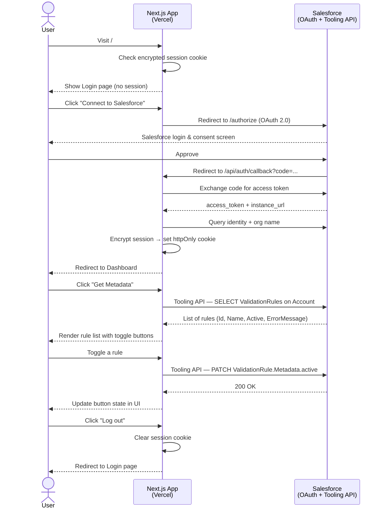
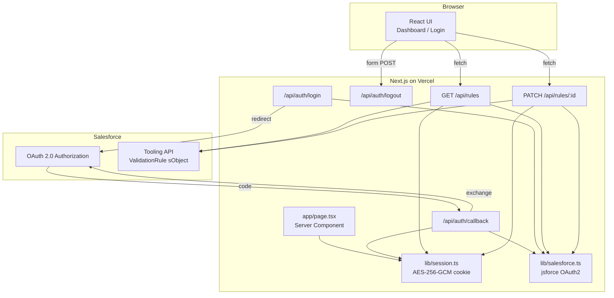

# Salesforce Validation Rules Switch

A minimal Next.js app that lets you sign in to any Salesforce org via OAuth and toggle validation rules on the **Account** object on or off — individually or all at once.

**Live:** [https://salesforce-switch-dun.vercel.app](https://salesforce-switch-dun.vercel.app)

---

## What it does

- Authenticates with Salesforce using OAuth 2.0 (Connected App)
- Fetches all validation rules on the `Account` object via the Tooling API
- Lets you enable or disable rules one at a time, or bulk-toggle all at once
- Stores your session in an encrypted, `httpOnly` cookie (AES-256-GCM) — no database needed

---

## Flow



---

## Architecture



---

## Tech stack

| Layer | Choice |
|---|---|
| Framework | Next.js 16 (App Router) |
| Language | TypeScript |
| Styling | Tailwind CSS v4 |
| Salesforce SDK | jsforce v3 |
| Session | AES-256-GCM encrypted cookie |
| Deployment | Vercel |

---

## Local setup

### 1. Create a Salesforce Connected App

In Salesforce Setup → App Manager → New Connected App:

- Enable OAuth, add scopes: `api`, `refresh_token`, `id`
- Callback URL: `http://localhost:3000/api/auth/callback`

### 2. Clone and install

```bash
git clone https://github.com/your-username/salesforce-switch.git
cd salesforce-switch
npm install
```

### 3. Configure environment

Create `.env.local`:

```env
SF_LOGIN_URL=https://login.salesforce.com
SF_CLIENT_ID=your_consumer_key
SF_CLIENT_SECRET=your_consumer_secret
APP_URL=http://localhost:3000
SESSION_SECRET=generate_a_64_char_hex_string
```

Generate a session secret:

```bash
node -e "console.log(require('crypto').randomBytes(32).toString('hex'))"
```

### 4. Run

```bash
npm run dev
```

Open [http://localhost:3000](http://localhost:3000).

---

## Deploying to Vercel

1. Push to GitHub and import the repo in Vercel
2. Add all five environment variables in **Settings → Environment Variables**:
   - `SF_CLIENT_ID`, `SF_CLIENT_SECRET`, `SF_LOGIN_URL`
   - `APP_URL` → your Vercel deployment URL (e.g. `https://salesforce-switch-dun.vercel.app`)
   - `SESSION_SECRET`
3. In Salesforce, add your Vercel URL's callback to the Connected App:
   `https://salesforce-switch-dun.vercel.app/api/auth/callback`
4. Redeploy

---

## API reference

| Method | Path | Description |
|---|---|---|
| `GET` | `/api/auth/login` | Redirects to Salesforce OAuth |
| `GET` | `/api/auth/callback` | Handles OAuth code exchange, sets session cookie |
| `POST` | `/api/auth/logout` | Clears session cookie |
| `GET` | `/api/rules` | Returns all Account validation rules |
| `PATCH` | `/api/rules/:id` | Toggles a single validation rule on/off |
